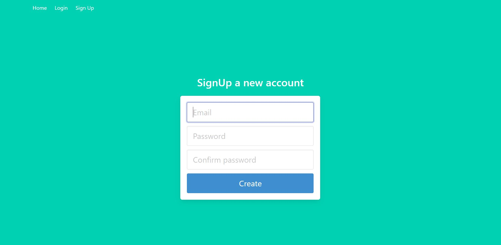

# Authentification Flask App with MYSQL Database hosted on pythonanywhere.com that returns the weather in your hometown

The application was build in Python3.10 using the Flask, Flask-Login and Flask-SqlAlchemy libraries, in order to combine the user authentification process with the MYSQL Database.The whole project is stored online, on [pythonanywhere] using a WSGI server.Backbone and html graphics are inspired from the [tutorial] posted on the DigitalOcean website which was modified to fullfil my requirements.


# Functionality
After accessing the main webpage, a new user must press the SignUp button in order to create a new user account.The SignUp window requires a valid and unique email address and a solid, more then 8 characters, password that is to include lower and capital letters, numbers and/or special characters. 


#### _Activation_
An activation code is sent on the user email address, with a 24hour valability and a 10 time retry rate.If any of this rules are broken, the Activation code will be resent.
#### _Profile_
After login, the new user must fill in the form, with Name, Lastname, DateOfBirth, Country, City, Address. Based on the filled-in address, the GPS Coordinates of the user address, will be generated, using the geopy.geodecode ArcGis library.All the filled in data is stored in the credentials table part of the MYSQL database.
#### _Weather_
After address submiting, Weather buton is activated on the webpage, that will show a map with the location of the users address, plus the current weather in this location.
#### _Change password_
The password can be reset after user authentification, by filling in the Old and New password.
#### _Password recovery_
From the LogIn webpage click on the "Forgot password" button and fill in the CODE received in the email inbox

#### _RestApi_
The user can receive the weather in their hometown using their USERNAME and API_KEY generated by the application.
```sh
GET https://YOUR_DOMAIN.pythonanywhere.com/api/weather?user=USERNAME
Headers:
    Authorization:API_KEY
```
You can generate a new API_KEY by clicking the "Renew Api Key" button

## Dependencies
```bash
pip install Flask
pip install Flask-SQLAlchemy
pip install flask-login
pip install requests
pip install geopy
pip install folium
pip install Werkzeug
```

## PythonAnywhere installation
Upload the file on the server using the following directory structure
```
my_application
│   README.md
│   api_weather.py
│   flask_app.py
│   aux_module.py
│   countries.py
│   map.py
│   weather.py
│
└───static
│   └───styles
│       │   base.css
│       │   bulma.min.css
│       │   switch.css  
│ 
└───templates
│       │  activation.html
│       │  administrator.html
│       │  base.html
│       │  change-password.html
│       │  error_page.html
│       │  index.html
│       │  login.html
│       │  profile.html
│       │  recovery.html
│       │  signup.html
│       │  weather.html
│
───weather_icons
        │  cloudy.png
        │  fog.png
        │  heavy_rain.png
        │  light_rain.png
        │  snow.png
        │  sunny.png
        │  thunderstorm.png
```
Create a database named yourusernam$webapp
```bash
yourusernam$webapp
```
Create a mysql table named credentials
```mysql
CREATE TABLE credentials(id SERIAL PRIMARY KEY, email VARCHAR(120) NOT NULL UNIQUE, password VARCHAR(100), name VARCHAR(120), firstname VARCHAR(120), birthdate VARCHAR(20), country VARCHAR(80), city VARCHAR(100), address VARCHAR(200), latitude FLOAT(5,2), longitude FLOAT(5,2), active BOOLEAN, activation_code VARCHAR(8), code_timestamp DATETIME, code_retries INTEGER, api_user VARCHAR(80), api_key VARCHAR(8));
```

Create a mysql table called parameters
```mysql
CREATE TABLE parameters(id SERIAL PRIMARY KEY, parameter_name VARCHAR(80) UNIQUE, bool_value BOOLEAN, int_value INTEGER, string_value VARCHAR(80), float_value FLOAT(5,2));
```

## Testing
Use python application to test the website functionallity:
```git bash
$ git clone https://github.com/dihorel/WeatherAppTesting
```


## Features
The weather can be read on a Telegram bot channel by sending the USERNAME:PASSWORD command to the created telegram bot.
Link to the telegram-bot application:
```git bash
$ git clone https://github.com/dihorel/WeatherAppTelegram
```

## Licenses
Free usage for non commercial usage


[tutorial]: <https://www.digitalocean.com/community/tutorials/how-to-add-authentication-to-your-app-with-flask-login>
[pythonanywhere]: <https://www.pythonanywhere.com>